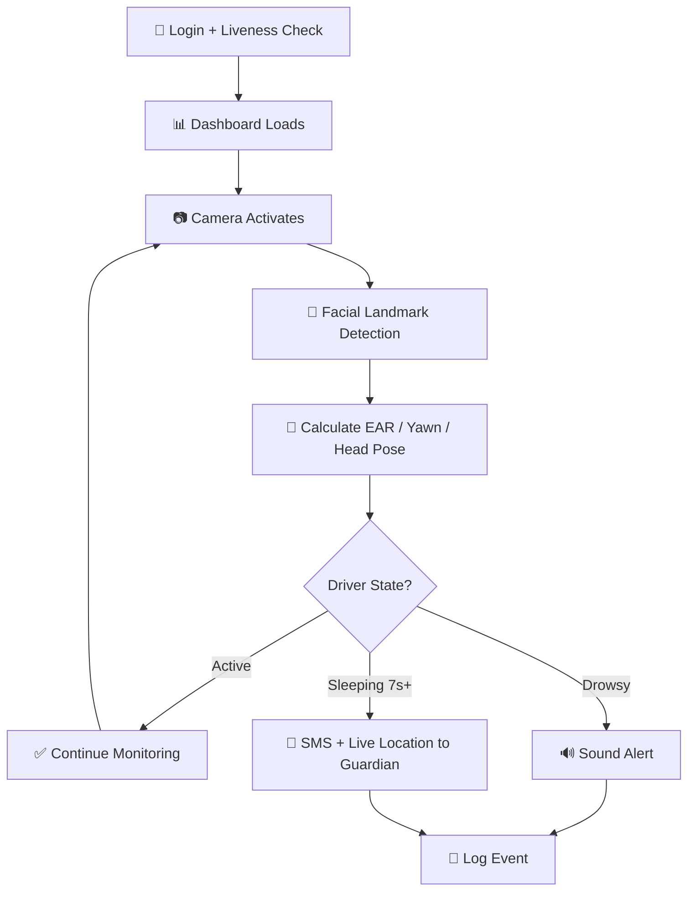

# 🛡️ AlertGuard
### AI-Powered Driver Drowsiness Detection & Safety Monitoring System
---

## 🎯 What Is AlertGuard?

AlertGuard watches the road *through the driver's face*. Using nothing but a webcam, it continuously reads eye closure, yawning, and head position — catching fatigue in the seconds before it becomes dangerous, not after. When drowsiness is detected it sounds an alert; when it becomes critical, it texts a guardian the driver's exact live location.

| 👁️ Eye Tracking | 😮 Yawn Detection | 🧭 Head Pose | 🔐 Face Login |
|:---:|:---:|:---:|:---:|
| EAR-based real-time analysis | Fatigue pattern recognition | Distraction alerts | Liveness-verified access |

---

## ✨ Features

<table>
<tr>
<td width="50%" valign="top">

### 🧠 Smart Detection
- Real-time **Eye Aspect Ratio (EAR)** tracking
- Yawn frequency analysis
- Head pose estimation for distraction
- Classifies state: `Active` → `Drowsy` → `Sleeping`

</td>
<td width="50%" valign="top">

### 🚨 Instant Response
- Audible alert on drowsiness
- Automatic **SMS + live GPS** to guardian on critical fatigue
- Timestamped logs, downloadable anytime

</td>
</tr>
<tr>
<td width="50%" valign="top">

### 🔐 Secure Access
- Facial recognition login
- Liveness detection blocks photo/video spoofing

</td>
<td width="50%" valign="top">

### 📊 Live Dashboard
- Camera feed + EAR graph
- Color-coded driver status
- Map view, alert panel, document upload

</td>
</tr>
</table>

---

## ⚙️ How It Works

---

## 🏗️ Architecture

| Module | Role |
|---|---|
| 🔐 **Authentication** | Registration, login, liveness detection |
| 👁️ **Detection** | EAR / yawn / head-pose analysis via MediaPipe |
| 📊 **Dashboard** | Real-time visualization of all data |
| 🔔 **Alerts** | Sound warnings + Twilio SMS |
| 🗺️ **Location** | Google Maps live tracking |
| 📝 **Logs** | Timestamped records, export support |

---
## 🧪 Testing

✅ Unit testing &nbsp; ✅ Integration testing &nbsp; ✅ Functional testing &nbsp; ✅ Performance testing &nbsp; ✅ Scenario-based simulation (active / drowsy / sleeping)

---

## 🗺️ Roadmap

- [ ] 🔌 Dedicated in-vehicle hardware build
- [ ] 🧠 Deep-learning models for higher accuracy
- [ ] 📳 Voice & vibration alerts, vehicle-control triggers
- [ ] ☁️ Cloud sync for logs & driving analytics
- [ ] 📱 Companion mobile app
- [ ] 🔮 Predictive fatigue warnings

---

## 👥 Team

| Name | Roll No. | Division |
|---|:---:|:---:|
| Anusha Patil | 2425000174 | B-44 |
| Pratik Patil | 2425000705 | B-46 |
| Shrutika Patil | 2425001031 | B-50 |
| Adarsh Gurav | 2425000776 | B-73 |
| Sanket Magdum | 2425000540 | B-77 |

**Guide:** Mr. Chaitanya Pednekar
**Institution:** Kolhapur Institute of Technology's College of Engineering, Kolhapur *(Empowered Autonomous)*

---

## 📚 References

[OpenCV](https://opencv.org) · [MediaPipe](https://developers.google.com/mediapipe) · [Flask](https://flask.palletsprojects.com) · [Twilio](https://www.twilio.com/docs) · [Google Maps Platform](https://developers.google.com/maps)

---

**Made with 🖤 for safer roads**

